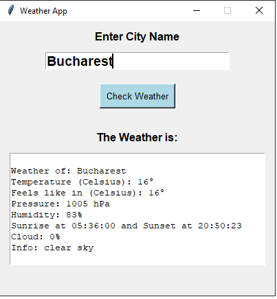

# Weather App

This is a simple weather application implemented in Python using the Tkinter library. It allows users to check the current weather conditions for a specific city by entering the city name.



## Table of Contents
- [Description](#description)
- [Installation](#installation)
- [Usage](#usage)
- [License](#license)

## Description

The Weather App retrieves current weather data from the OpenWeatherMap API based on the user-input city name. It displays information such as temperature, feels like temperature, pressure, humidity, wind speed, sunrise time, sunset time, cloudiness, and weather description.

## Installation

1. Ensure you have Python installed on your system.
2. Clone this repository to your local machine using the following command:
3. Navigate to the project directory:
4. Install the required dependencies by running:
5. Obtain an API key from [OpenWeatherMap](https://openweathermap.org/api) and replace `"YOUR_API_KEY"` in the script with your actual API key.

## Usage

1. Run the Python script in your preferred environment.
2. Enter the name of the city for which you want to check the weather in the provided text field.
```sh
gh repo clone aFro95/Weather-app
```
3. Click the "Check Weather" button to retrieve the weather information for the specified city.
```sh
cd weather-app
```
4. The weather details, including temperature, pressure, humidity, wind speed, sunrise time, sunset time, cloudiness, and weather description, will be displayed in the text area below.
```sh
pip install requests
```
5. If the city name is invalid or not found, an appropriate message will be displayed.

## License

This project is licensed under the MIT License.
